# Cartoonization
Pytorch testing code of [CartoonGAN](http://openaccess.thecvf.com/content_cvpr_2018/CameraReady/2205.pdf) `[Chen et al., CVPR18]`.

<p>
    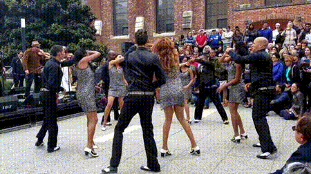
    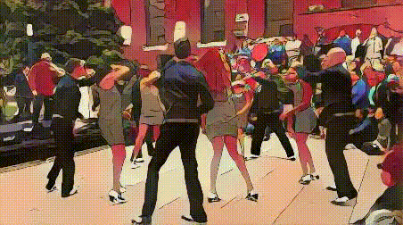
</p>


## Getting started

- Linux
- NVIDIA GPU
- Pytorch 0.3
- Torch

```
!git clone https://github.com/vinaysai37/CartoonGAN.git
cd CartoonGAN
```

## Pytorch

- For testing:

```
!python test.py --input_dir YourImgDir --style Hosoda --gpu 0
```


## Examples (Left: input, Right: output)

<p>
    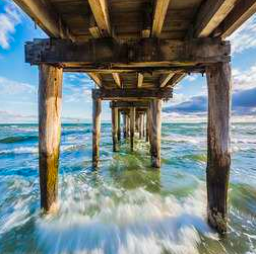
    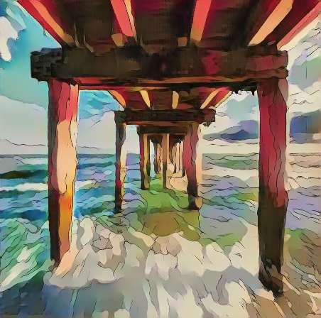
</p>

<p>
    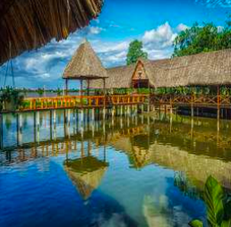
    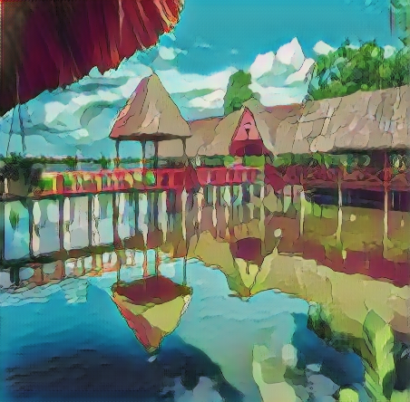
</p>

<p>
    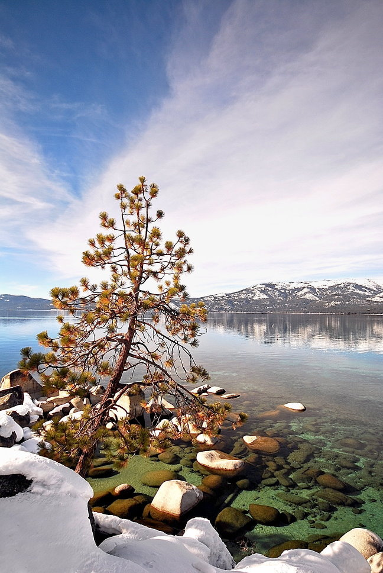
    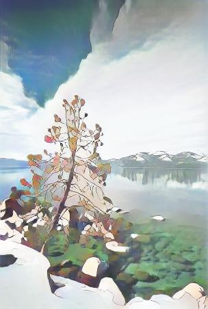
</p>

<p>
    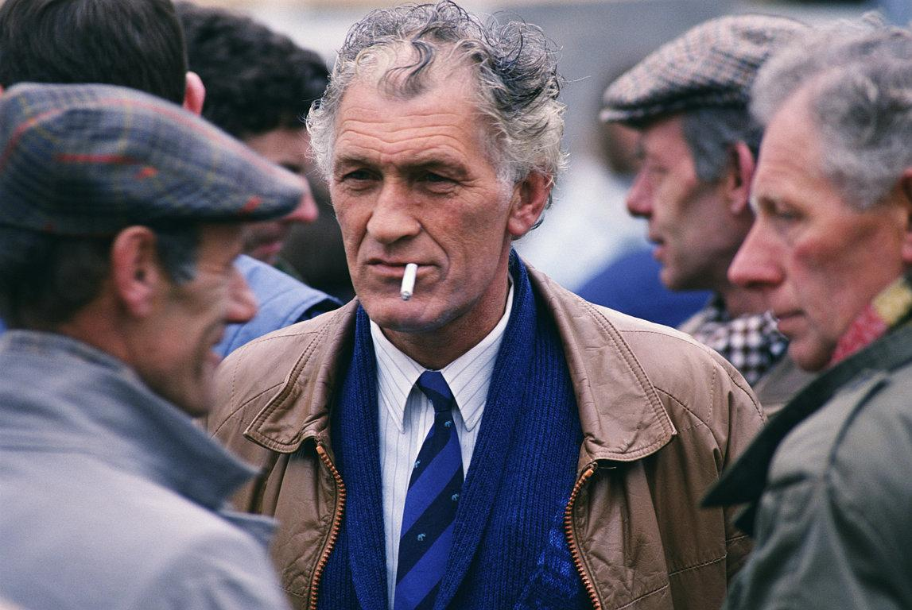
    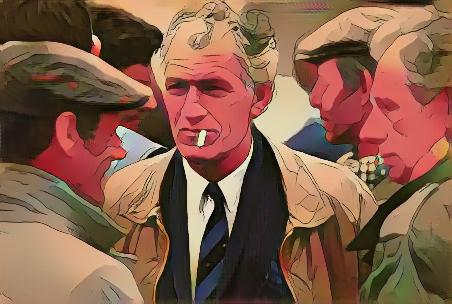
</p>

<p>
    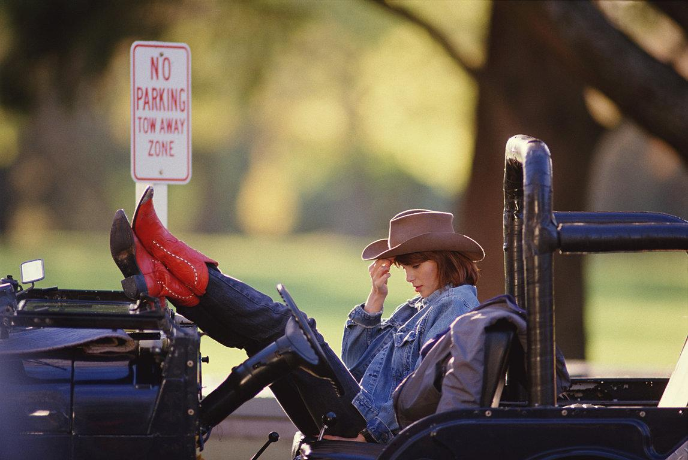
    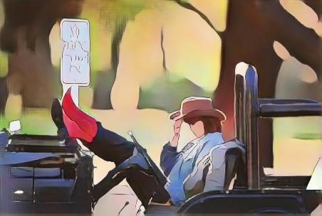
</p>


## Note

- The training code should be similar to the popular GAN-based image-translation frameworks and thus is not included here.

## Acknowledgement

- Part of the codes are borrowed from [DCGAN](https://github.com/soumith/dcgan.torch), [TextureNet](https://github.com/DmitryUlyanov/texture_nets), [AdaIN](https://github.com/xunhuang1995/AdaIN-style) and [CycleGAN](https://github.com/junyanz/pytorch-CycleGAN-and-pix2pix).

